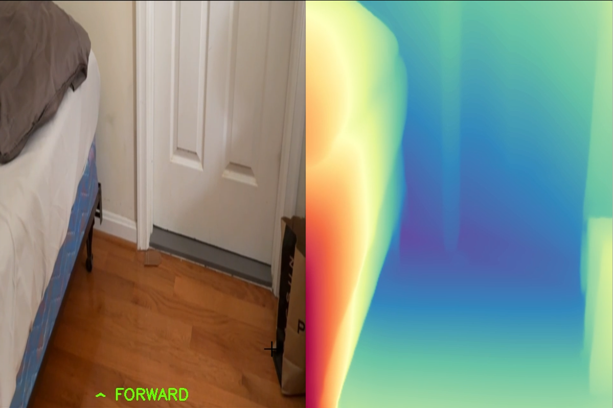

# HealthTech

A computer vision assistive technology project built to help visually impaired users navigate indoor environments. The system combines real-time depth estimation, object detection, OCR, and visual odometry to understand the environment and guide the user.

---

## What This Project Does

HealthTech uses a phone or webcam as the primary sensor and runs several AI models to provide real-time environmental awareness:

- **Obstacle avoidance** — estimates depth across the camera feed and tells the user which direction to move
- **Door detection** — detects door frames using a custom-trained YOLO model to help navigate to exits
- **Text reading** — reads signs and labels in the environment using OCR
- **Live mapping** — builds a 2D top-down map of the user's path using visual odometry

---

Example Image:


---

## Project Structure

```
HEALTHTECH/
├── Depth-Anything-V2/       # Depth estimation model (submodule/library)
├── depthmodels/             # Downloaded model weights (.pth files)
├── DoorFrameData/           # Training images for the door frame YOLO model
├── YoloModels/              # YOLO model weights (.pt files)
├── TestImage/               # Static test images
├── runs/                    # YOLO training run outputs
│
├── navigation.py            # Main navigation module (depth + door detection + steering)
├── vo_mapper.py             # Visual odometry 2D mapper
├── liveOCR.py               # Live OCR from camera feed
├── OCR.py                   # Static image OCR
├── yolo.py                  # Standalone YOLO object detection
├── depth.py                 # Standalone depth estimation viewer
├── collectData.py           # Tool for collecting door frame training images
└── main.py                  # Entry point (currently a stub)
```

---

## Modules

### `navigation.py`
The core module. Reads from a camera, runs Depth Anything V2 for depth estimation, and runs a custom door frame YOLO model. Splits the frame into 6 zones (top/bottom × left/center/right) to compute a steering direction — Forward, Turn Left, or Turn Right — and overlays it on the video feed.

Run it with:
```bash
python navigation.py --source 1
```
Optional flags: `--yolo-interval N`, `--depth-interval N`

### `vo_mapper.py`
Builds a live 2D top-down map using optical flow (Lucas-Kanade) for position tracking and Depth Anything V2 for placing detected objects on the map. Saves the final map as `map_output.png` when you press `q`.

Run it with:
```bash
python vo_mapper.py --source 1
```

### `liveOCR.py`
Reads text from a live camera feed using EasyOCR and draws bounding boxes with labels on screen. Useful for reading room signs, exit signs, etc.

Run it with:
```bash
python liveOCR.py
```

### `depth.py`
A simple viewer that shows the raw depth map alongside the camera feed. Good for testing depth model behavior without the full navigation stack.

### `yolo.py`
Standalone YOLO detection using the door frame model. Useful for testing model accuracy on its own.

### `collectData.py`
Utility for collecting training images. Opens a live camera feed; press **Space** to save a frame to `DoorFrameData/images/Train/`, press **ESC** to exit.

---

## Setup

### Requirements

- Python 3.12.12
- A webcam or phone camera (the project uses [Camo](https://reincubate.com/camo/) to use a phone as a webcam — camera index `1` assumes Camo is running; change to `0` for a built-in webcam)
- NVIDIA GPU recommended for real-time performance (CPU works but will be slow)

### Install Dependencies

We recommend using **uv** to manage dependencies. It will install Python automatically if you don't have it.

**1. Install uv** (run in PowerShell):
```powershell
powershell -ExecutionPolicy ByPass -c "irm https://astral.sh/uv/install.ps1 | iex"
```
Full installation guide: https://docs.astral.sh/uv/getting-started/installation/

**2. Add uv to your PATH** (required in the same PowerShell session after install):
```powershell
$env:Path = "C:\Users\<YourUsername>\.local\bin;$env:Path"
```
To make this permanent so new PowerShell windows find `uv` automatically:
```powershell
[Environment]::SetEnvironmentVariable("Path", "C:\Users\<YourUsername>\.local\bin;" + [Environment]::GetEnvironmentVariable("Path", "User"), "User")
```

**3. Create and activate a virtual environment:**
```powershell
uv venv
```
If activating scripts is blocked, first run:
```powershell
Set-ExecutionPolicy RemoteSigned -Scope CurrentUser -Force
```
Then activate:
```powershell
.venv\Scripts\activate
```

**4. Install dependencies:**
```powershell
uv pip install torch torchvision opencv-python ultralytics easyocr matplotlib numpy soundfile sounddevice
```

**Alternative (if you already have Python and pip):**
```bash
pip install torch torchvision opencv-python ultralytics easyocr matplotlib numpy soundfile sounddevice
```

**5. Clone the Depth Anything V2 repo** into the project folder:
```bash
git clone https://github.com/DepthAnything/Depth-Anything-V2
```

### VS Code Setup

If you're using VS Code, make sure it uses the `.venv` interpreter so the play button works correctly:

1. Press **Ctrl+Shift+P**
2. Type **Python: Select Interpreter** and select it
3. Choose the `.venv` option, or click **Enter interpreter path** and paste:
   ```
   C:\Users\<YourUsername>\.venv\Scripts\python.exe
   ```

Without this, VS Code may use a different Python installation that doesn't have the packages installed.

### Download Model Weights

Place these in the `depthmodels/` folder:
- `depth_anything_v2_vits.pth` — download from the [Depth Anything V2 releases](https://github.com/DepthAnything/Depth-Anything-V2/releases)

The YOLO model weights (`doorFrameModel.pt`, `doorFrameModel1.pt`, `yolov11n.pt`) go in `YoloModels/`.

---

# KNOWN ISSUES & TODOs (Ethan, Kenshi, Sahir)

**1.** `navigation.py` — depth model should be swapped for NCNN/TFLite (faster/more efficient); `navigate()` doesn't return a value yet; no text-to-speech output

**2.** In `navigation.py` combine object avoidance with the navigation to a specific object & also use default yolo model to detect chairs and tables to avoid

**3.** Integrate LLM or reasoning model

**4.** Memory(Remeber the past locations we have gone to)

**5.** Improve OCR recognition accuracy

**6.** Actual Implementation of going anywhere by saying something(get voice stuff working)

**7.** Implement into APP

**8.** Be happy!


---

## Team

| Name | Role / Module |
|---|---|
| Kenshi Kadarusman | `main.py`, `liveOCR.py`, `collectData.py`, `navigation.py` |
| Rishan Reddy | `depth.py`, `yolo.py` |
| Ethan Chan | `OCR.py`, `liveOCR.py`, `navigation.py` |
| Gurveer Minhas | `vo_mapper.py` |
| Sahir Abrar | `navigation.py`, `liveOCR.py` |
| Ritesh Phuyal | `OCR.py`, `collectData.py` |
| Mustafa Ahmed | `collectData.py` |